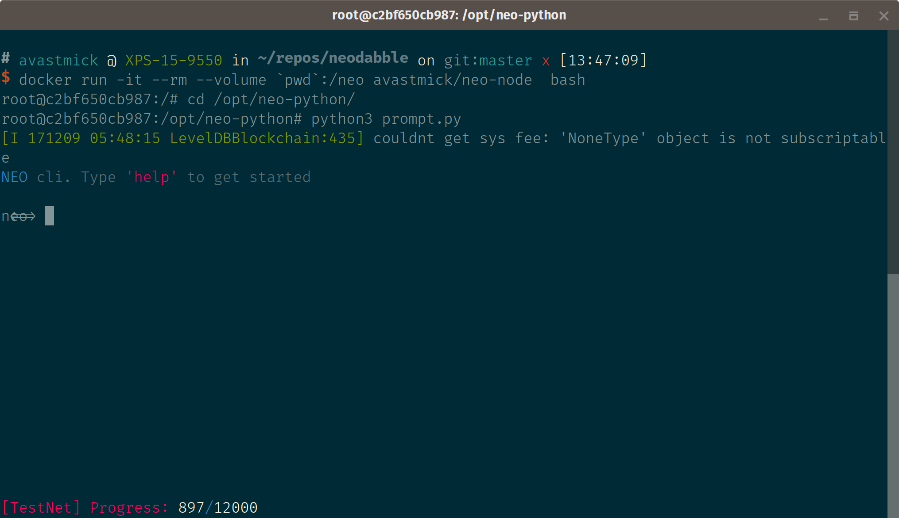

# Local Client

This describes how to install and configure the NEO clients

# NEO GUI

**Windows only**

# NEO cli

Going to use the python node client using the latest python image 3.6.3 (12/7/2017)

```bash
docker run -it --rm --volume $(pwd):/src python  bash
```

# Neo-python

Test it is working: running with the container to ``rm`` on exit

*Note:* Remember to configure to use the same network as neo-privnet

``--net=neo-privnet``

Note: using the ``-p`` flag for the ``prompt.py`` to set it to use the privnet

```bash

$ cd node/neo-python
$ docker build -t avastmick/neo-node .
$ cd ../..
$ docker run -it --rm --net=neo-privnet --volume $(pwd):/neo avastmick/neo-node  bash
$ cd /opt/neo-python
$ python3 prompt.py -p

```

You should see:

 


Then run it as a permanent container that can be restarted:

```bash
$ docker run -it --name neo-python --net=neo-privnet --volume $(pwd):/neo avastmick/neo-node  bash
root@c2bf650cb987: exit
$
$ docker start -i neo-python
root@c2bf650cb987: cd /opt/neo-python  
root@c2bf650cb987: python3 prompt.py -p

```

Once the prompt is up create a wallet and import the privnet WIF:

```
    WIF key: KxDgvEKzgSBPPfuVfw67oPQBSjidEiqTHURKSDL1R7yGaGYAeYnr
    Address: AK2nJJpJr6o664CWJKi1QRXjqeic2zRp8y
```

```

neo> create wallet devwallet
[Password 1]> **********
[Password 2]> **********
...
neo> import wif KxDgvEKzgSBPPfuVfw67oPQBSjidEiqTHURKSDL1R7yGaGYAeYnr
neo> wallet rebuild

```


    
