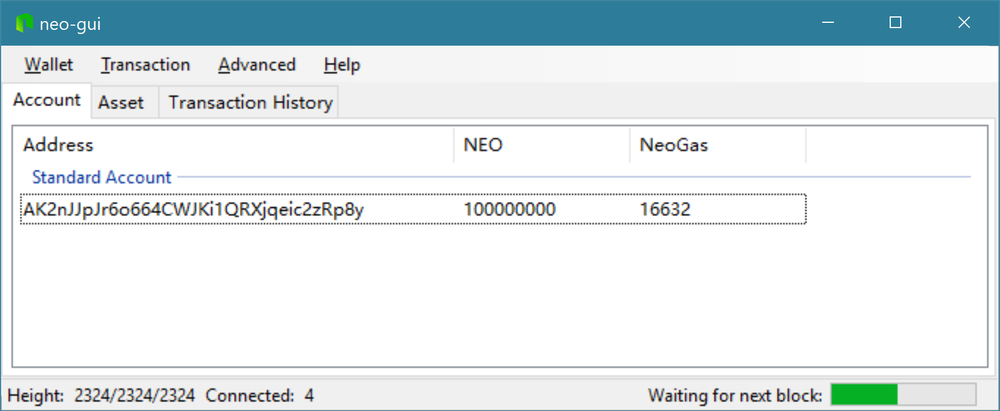

# Local Private Network

Set up a private local Neo network


# Setup local client

You can configure the local NEO-GUI client to use a private testnet

- Download the neo-gui application from [HERE](https://github.com/neo-project/neo-gui/releases)
- Unzip to a suitable location
- In the folder there are two files to edit
  + ``protocol.json``
  + ``config.json``

Replace the contents or each with the following:

## ``protocol.json``

```json
{
  "ProtocolConfiguration": {
    "Magic": 56753,
    "AddressVersion": 23,
    "StandbyValidators": [
      "02b3622bf4017bdfe317c58aed5f4c753f206b7db896046fa7d774bbc4bf7f8dc2",
      "02103a7f7dd016558597f7960d27c516a4394fd968b9e65155eb4b013e4040406e",
      "03d90c07df63e690ce77912e10ab51acc944b66860237b608c4f8f8309e71ee699",
      "02a7bc55fe8684e0119768d104ba30795bdcc86619e864add26156723ed185cd62"
    ],
    "SeedList": [
      "127.0.0.1:20333",
      "127.0.0.1:20334",
      "127.0.0.1:20335",
      "127.0.0.1:20336"
    ],
    "SystemFee": {
      "EnrollmentTransaction": 1000,
      "IssueTransaction": 500,
      "PublishTransaction": 500,
      "RegisterTransaction": 10000
    }
  }
}

```

## ``config.json``

```json
{
  "ApplicationConfiguration": {
    "DataDirectoryPath": "ChainPrivTestNet",
    "CertCachePath": "Certs",
    "NodePort": 20333,
    "WsPort": 10334,
    "RPCPort": 30334,
    "UriPrefix": [ "http://*:20332" ],
    "SslCert": "",
    "SslCertPassword": "",
    "Urls": {
      "AddressUrl": "http://testnet.antchain.xyz/address/{0}",
      "AssetUrl": "http://testnet.antchain.xyz/asset/hash/{0}",
      "TransactionUrl": "http://testnet.antchain.xyz/tx/hash/{0}"
    }
  }
}
```

Now run the network


# Running Docker image

```bash
> docker pull metachris/neo-privnet-with-gas
> docker run -d --name neo-privnet -p 20333-20336:20333-20336/tcp -p 30333-30336:30333-30336/tcp metachris/neo-privnet-with-gas
```

## Interacting

```bash

$ docker exec -ti neo-privnet bash
root@6fe70962f7c8:/# cd /opt/node1/neo-cli
root@6fe70962f7c8:/opt/node1/neo-cli#

```

## Closing down

```bash

$ docker stop neo-privnet

```

## Remove

```bash

$ docker rm -f neo-privnet

```

# Running the desktop client

Start the Neo-GUI client by clicking on ``neo-gui.exe``

## Import the wallet

1. ``Wallet -> "Open Wallet Database..."``
2. Select the wallet in this repo [node/wallet/dev.db3](node/wallet/dev.db3)
3. Enter password ``dev``
4. Rebuild index for wallet ``Wallet -> "Rebuild Index"``

If everything is working, you should see the following:

